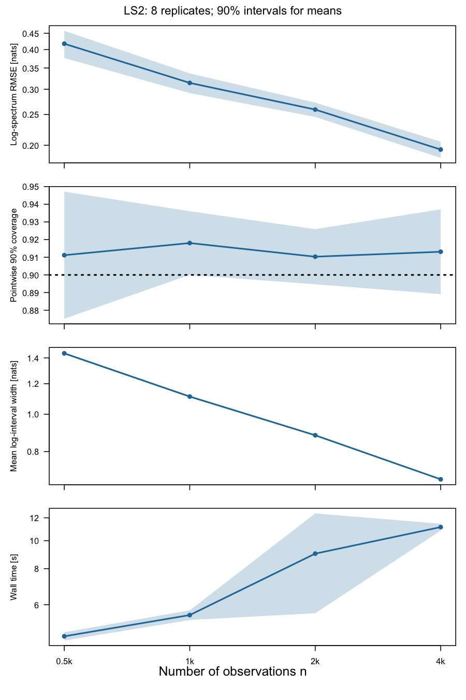
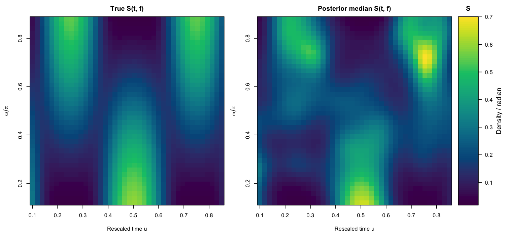
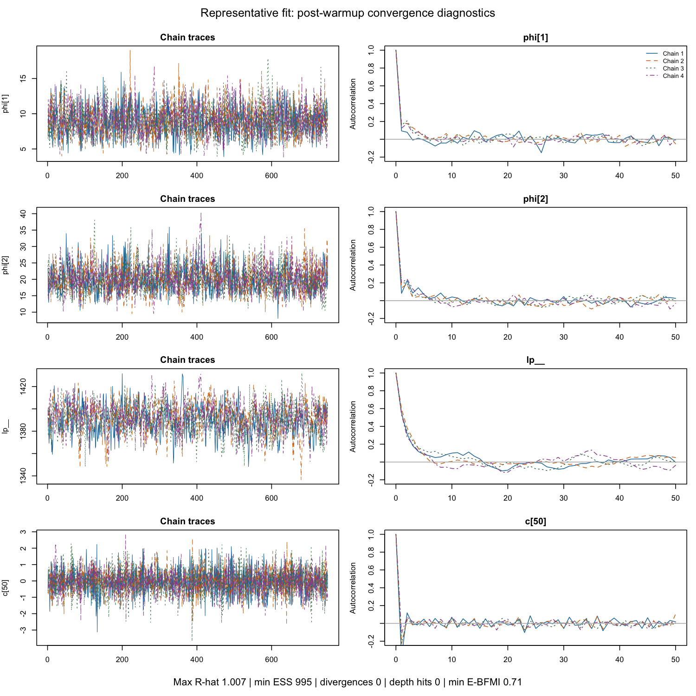
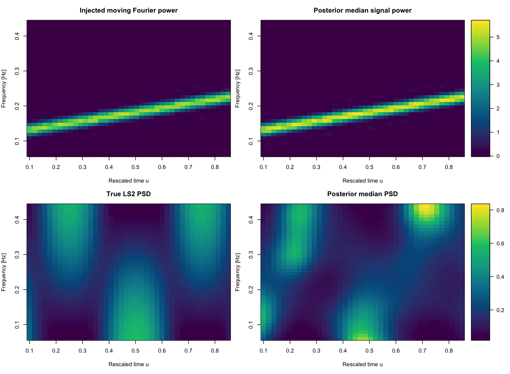
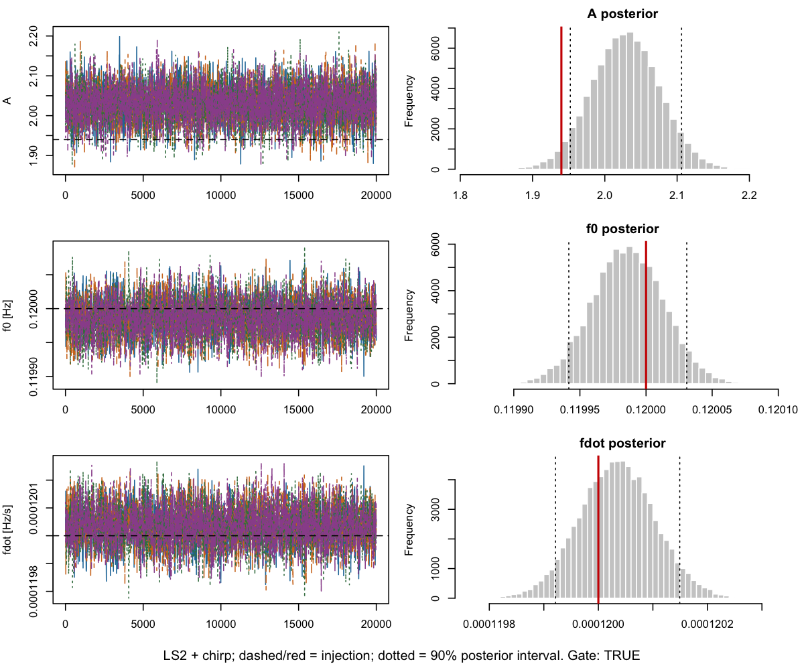

# Moving-periodogram P-spline demo in R

Estimate a time-varying PSD from simulated LS2 data using a moving periodogram,
tensor P-splines and Stan NUTS. A repeated study measures error, pointwise coverage,
interval width and runtime for n=512–4096.

## Run

From the repository root:

```sh
Rscript setup.R             # install missing CmdStanR, posterior and CmdStan
Rscript examples/one_fit.R  # one PSD fit
Rscript demo.R study        # repeated study
Rscript demo.R --help       # modes and options
Rscript tests.R             # numerical checks
```

Stan requires a C++ toolchain; see the [CmdStanR setup guide](https://mc-stan.org/cmdstanr/articles/cmdstanr.html).

## Example results

Eight realizations per n; bands show 90% confidence intervals for mean metrics.
[Saved metrics and asset provenance](assets/README.md).





<details>
<summary>Sampler diagnostics</summary>



</details>

## Signal + PSD example

Estimate a chirp's amplitude, `(f0, fdot)` and PSD in LS2 noise at injected SNR 40,
using amplitude Gibbs and blocked Metropolis updates:

```sh
Rscript examples/blocked_joint.R
```

[Sampler details](examples/BLOCKED.md). An [experimental all-parameter Stan version](examples/STAN.md)
is also available, but has not been validated.



<details>
<summary>Signal diagnostics</summary>



</details>

## Load results

Each run prints its output directory under `results/`. Studies save figures,
CSV metrics and summaries, posterior draws, settings and software versions.
Replace the path below with your study directory:

```r
out <- "results/study-YYYYMMDD-HHMMSS"
metrics <- read.csv(file.path(out, "metrics.csv"))
case <- readRDS(file.path(out, "representative.rds"))
head(metrics)
case$diagnostics
head(case$surface)

# Redraw without rerunning MCMC:
source("R/plot.R")
plot_spectra(case, file.path(out, "spectra.png"))
```

## Where the functions live

| File | Main functions / purpose |
|---|---|
| `R/simulate.R` | `simulate_ls2`, `true_psd_ls2`: simulation and analytic PSD |
| `R/moving_periodogram.R` | `moving_periodogram`: scattered time-frequency ordinates |
| `R/pspline.R` | `spline_setup`, `basis`: spline bases and penalties; `prepare_model`, `fit_pspline`: Stan fitting; `summarize_surface`, `fit_diagnostics`: summaries |
| `R/plot.R` | `study_summary`, `plot_study`, `plot_convergence`, `plot_spectra` |
| `model.stan` | PSD likelihood and spline prior |
| `R/chirp.R` | Chirp waveform, moving Fourier transform and SNR helpers |
| `R/blocked.R`, `R/blocked_plot.R` | `blocked_chain`, `plot_blocked`: signal/PSD sampling and figures |
| `examples/one_fit.R`, `examples/blocked_joint.R` | Single-fit and signal/PSD examples |
| `joint.stan`, `examples/stan_joint.R` | Experimental all-parameter NUTS example |
| `demo.R` | Repeated-study driver |
| `setup.R`, `tests.R` | Dependencies and numerical checks |

[Validation notes](VALIDATION.md) ·
[Dynamic Whittle reference](https://doi.org/10.1080/01621459.2025.2594191)
